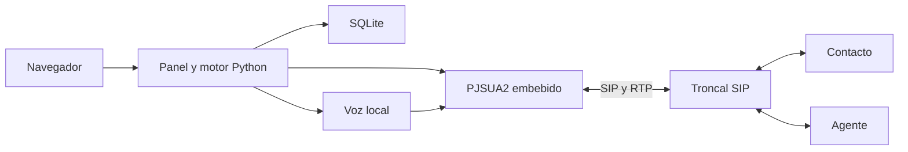

# Python Blaster TTS

Plataforma web en Python para campañas telefónicas por SIP con mensajes de voz
personalizados, detección acústica de buzón, conexión con agentes y analítica.
El panel, la cola y el puente de audio funcionan en un único proceso. No requiere
Asterisk, FreeSWITCH, Redis ni una API de TTS externa.

**Ejecución local en macOS desde la carpeta del proyecto y su entorno `.venv`.**
El panel se abre en [localhost:8765](http://localhost:8765). La
[guía local](docs/local.md) explica el arranque y la configuración.

## Arrancar en tu Mac

Si ya tienes `.venv`, `config.toml` y el modelo de voz en esta carpeta:

```bash
.venv/bin/python run.py --config config.toml --check
.venv/bin/python run.py --config config.toml
```

También puedes abrir **`iniciar.command`** con doble clic o ejecutarlo con
`./iniciar.command`. Utiliza el Python de `.venv` y la configuración de esta
carpeta. Mantén la terminal abierta; **Ctrl+C** detiene la aplicación.

Los valores del panel para uso local, antes de cualquier sección del TOML, son:

```toml
web_public_url = ""
web_port = 8765
data_dir = "data"
voice_model = "voices/es_MX-claude-high.onnx"
```

El arranque local no requiere dominio, túnel, usuario de servicio ni instalación
global de la aplicación. Los datos, modelos y dependencias permanecen dentro del
proyecto. Para una copia nueva, consulta la [preparación local](docs/local.md).

## Funcionalidades

- Campañas desde CSV o XLSX con Credito y Telefono obligatorios, números nacionales
  y selector de país (México por defecto), variables libres y plantillas reutilizables.
- Interfaz completa en español e inglés, temas claro y oscuro con detección
  inicial del sistema, preferencias guardadas en el navegador y reportes
  manuales generados en el idioma seleccionado.
- Desde el creador: guardar borrador, iniciar al momento o programar fecha, hora
  y zona horaria; historial de ejecuciones programadas y cancelación de pendientes.
- Desde el detalle: volver a ejecutar con CDR independientes o duplicar como
  borrador, conservando el origen, el historial y la auditoría de cada envío.
- Pools de transferencia con una llamada por teléfono, rotación en orden,
  selección aleatoria o prioridad, espera configurable y pausa automática de
  nuevas marcaciones mientras todos los destinos estén ocupados.
- Catálogo de voces locales Piper y Kokoro, cambio desde el panel,
  prueba audible y recomendación basada en la latencia medida en el equipo.
- Vista previa antes de crear una campaña con tiempo de generación, duración del
  audio y factor respecto al tiempo real.
- DTMF: **1** repite el mensaje; **2** marca al agente y conecta ambos extremos.
- AMD sin modelos de IA: reglas de voz, pausas y tonos antes del TTS, con captura
  temporal del saludo, reproducción y etiquetado humano para calibración.
- Una o varias troncales, prioridades, respaldo y distribución de carga.
- Límites globales y por troncal: concurrencia, canales, CPS y puertos SIP/RTP.
- Dashboard, CDR por sesión/tramo con nombre e ID de troncal, cronología y
  trazabilidad global por Credito o Telefono, con XLSX y ZIP masivo de
  grabaciones disponibles más su manifiesto.
- Programación de campañas, reportes automáticos y alertas dentro del panel.
- Usuarios con roles, auditoría y grabaciones locales Ogg Opus desde evidencia humana.
- Simulación sin abrir la troncal ni realizar llamadas.

Los archivos de contactos pueden usar `Credito`/`Telefono` o
`Account`/`Phone`. En el mensaje también están disponibles sus alias
`{credito}`/`{telefono}` y `{account}`/`{phone}`, además de cualquier encabezado
personalizado del archivo.

## Arquitectura y alcance

| Componente | Implementación |
|---|---|
| Panel y API | FastAPI, Uvicorn, HTML/CSS/JavaScript y Chart.js local |
| Telefonía | PJSIP/PJSUA2 2.17 embebido, controlado desde Python |
| Voz | Piper y Kokoro ONNX locales |
| AMD | Python/NumPy, análisis acústico determinista |
| Datos | SQLite; grabaciones y reportes en archivos locales |
| Ejecución local | Terminal, Python de `.venv`, HTTP en loopback |

La aplicación usa bibliotecas nativas C/C++ para SIP, medios y síntesis. Las voces
utilizan modelos locales; el detector AMD no utiliza IA.



Se ejecuta una campaña a la vez, con varias sesiones simultáneas. Cada sesión
reserva **dos canales en una misma troncal**. Python mantiene el puente hasta
que termina la conversación. Se admiten hasta ocho troncales y 60 canales
globales; estos límites no garantizan una capacidad concreta de hardware.

SIP usa IPv4, UDP/TCP, PCMU/PCMA y DTMF telephone-event. No se implementan
TLS/SRTP, WebRTC, transferencia REFER ni distribución entre varios servidores.
AMD necesita audio después de contestar: puede equivocarse y no evita
necesariamente el cargo inicial del proveedor.

## Probar en simulación

Desde una copia nueva del repositorio, con Python 3.12 instalado. Si ya tienes
un TOML, comprueba que `mode = "simulation"` antes de ejecutar:

```bash
python3.12 -m venv .venv
.venv/bin/python -m pip install -c constraints.txt .
if [ ! -f config.toml ]; then
  cp config.example.toml config.toml
fi
chmod 600 config.toml
.venv/bin/python run.py --config config.toml
```

Abre [el panel local](http://127.0.0.1:8765), crea el primer administrador y utiliza
la demostración. La simulación no genera llamadas reales y usa audio silencioso.
Para escuchar TTS se necesita una voz local instalada, como explica la
[guía de desarrollo](CONTRIBUTING.md).

La simulación admite Python 3.11–3.13 en Linux/macOS. El instalador de producción
requiere Python 3.12 o 3.13. Windows nativo no está soportado.

## Documentación

| Guía | Contenido |
|---|---|
| [Ejecución local en Mac](docs/local.md) | Arranque desde la carpeta, entorno y localhost |
| [Instalación en Ubuntu](INSTALL.md) | Servidor limpio, usuario, Python, systemd y Cloudflare Tunnel |
| [Cloudflare Tunnel](docs/cloudflare-tunnel.md) | Dominio, servicio, token, actualización y diagnóstico |
| [Configuración](docs/configuration.md) | TOML, SIP, varias troncales, puertos y límites |
| [Uso del panel](docs/usage.md) | Campañas, roles, agenda, CDR, reportes y grabaciones |
| [Producción](docs/production.md) | Servicio, actualización, respaldos y recuperación |
| [Solución de problemas](docs/troubleshooting.md) | APT, Python, arranque, SIP y audio |
| [AMD](docs/amd.md) | Funcionamiento y calibración |
| [Vista previa TTS](docs/tts-preview.md) | Generación y reproducción de muestras |
| [Evaluación de Kokoro](docs/kokoro-experiment.md) | Instalación aislada, medición y reversión |
| [Arquitectura](docs/architecture.md) | Hilos, medios, persistencia y estados |
| [Contribuir](CONTRIBUTING.md) | Desarrollo y propuestas de cambios |
| [Seguridad](SECURITY.md) | Datos privados y reporte de vulnerabilidades |
| [Pruebas](docs/verification.md) | Validación reproducible y cobertura |

Los dominios `example.com`, los servidores `.example` y los contactos de
`examples/` son ejemplos. Sustitúyelos por tus datos al configurar una instalación.
El repositorio no incluye credenciales ni una base de datos de producción.

## Licencia

El código original se distribuye bajo [MIT](LICENSE). Las bibliotecas y modelos
conservan sus propias licencias; consulta [THIRD_PARTY.md](THIRD_PARTY.md).
