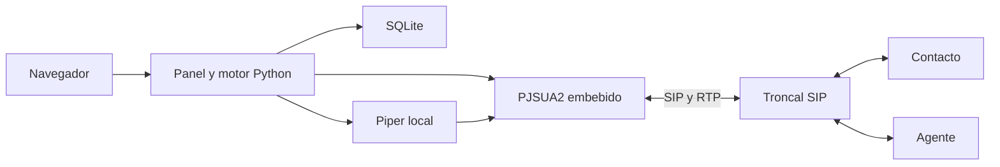

# Python Blaster TTS

Plataforma web en Python para campañas telefónicas por SIP con mensajes de voz
personalizados, detección acústica de buzón, conexión con agentes y analítica.
El panel, la cola y el puente de audio funcionan en un único proceso. No requiere
Asterisk, FreeSWITCH, Redis ni una API de TTS externa.

**Empieza por [INSTALL.md](INSTALL.md) para instalar desde cero en Ubuntu.**
Incluye el usuario `deploy`, Python 3.12, la troncal y el servicio systemd.

## Funcionalidades

- Campañas desde CSV, variables por contacto y plantillas reutilizables.
- Piper local y vista previa de voz antes de crear una campaña.
- DTMF: **1** repite el mensaje; **2** marca al agente y conecta ambos extremos.
- AMD sin modelos de IA: reglas de voz, pausas y tonos antes del TTS.
- Una o varias troncales, prioridades, respaldo y distribución de carga.
- Límites globales y por troncal: concurrencia, canales, CPS y puertos SIP/RTP.
- Dashboard, CDR por sesión/tramo, cronología, exportación CSV y Excel.
- Programación de campañas, reportes automáticos y alertas dentro del panel.
- Usuarios con roles, auditoría y grabaciones locales Ogg Opus desde evidencia humana.
- Simulación sin abrir la troncal ni realizar llamadas.

## Arquitectura y alcance

| Componente | Implementación |
|---|---|
| Panel y API | FastAPI, Uvicorn, HTML/CSS/JavaScript y Chart.js local |
| Telefonía | PJSIP/PJSUA2 2.17 embebido, controlado desde Python |
| Voz | Piper y modelos ONNX locales |
| AMD | Python/NumPy, análisis acústico determinista |
| Datos | SQLite; grabaciones y reportes en archivos locales |
| Servicio Ubuntu | systemd, usuario `blaster`, HTTP en loopback |

La aplicación usa bibliotecas nativas C/C++ para SIP, medios y síntesis. Piper
utiliza un modelo neuronal; el detector AMD no utiliza IA.



Se ejecuta una campaña a la vez, con varias sesiones simultáneas. Cada sesión
reserva **dos canales en una misma troncal**. Python mantiene el puente hasta
que termina la conversación. Se admiten hasta ocho troncales y 60 canales
globales; estos límites no garantizan una capacidad concreta de hardware.

SIP usa IPv4, UDP/TCP, PCMU/PCMA y DTMF telephone-event. No se implementan
TLS/SRTP, WebRTC, transferencia REFER ni distribución entre varios servidores.
AMD necesita audio después de contestar: puede equivocarse y no evita
necesariamente el cargo inicial del proveedor.

## Probar en simulación

Desde una copia nueva del repositorio, con Python 3.12 instalado. Si ya tienes
un TOML, comprueba que `mode = "simulation"` antes de ejecutar:

```bash
python3.12 -m venv .venv
.venv/bin/python -m pip install -c constraints.txt .
if [ ! -f config.toml ]; then
  cp config.example.toml config.toml
fi
chmod 600 config.toml
.venv/bin/python run.py --config config.toml
```

Abre [el panel local](http://127.0.0.1:8765), crea el primer administrador y utiliza
la demostración. La simulación no genera llamadas reales y usa audio silencioso.
Para escuchar TTS se necesita Piper y un modelo, como explica la
[guía de desarrollo](CONTRIBUTING.md).

La simulación admite Python 3.11–3.13 en Linux/macOS. El instalador de producción
requiere Python 3.12 o 3.13. Windows nativo no está soportado.

## Documentación

| Guía | Contenido |
|---|---|
| [Instalación desde cero](INSTALL.md) | Servidor, usuario, Python, instalación y acceso |
| [Configuración](docs/configuration.md) | TOML, SIP, varias troncales, puertos y límites |
| [Uso del panel](docs/usage.md) | Campañas, roles, agenda, CDR, reportes y grabaciones |
| [Producción](docs/production.md) | Servicio, actualización, respaldos y recuperación |
| [Solución de problemas](docs/troubleshooting.md) | APT, Python, arranque, SIP y audio |
| [AMD](docs/amd.md) | Funcionamiento y calibración |
| [Vista previa TTS](docs/tts-preview.md) | Generación y reproducción de muestras |
| [Arquitectura](docs/architecture.md) | Hilos, medios, persistencia y estados |
| [Contribuir](CONTRIBUTING.md) | Desarrollo y propuestas de cambios |
| [Seguridad](SECURITY.md) | Datos privados y reporte de vulnerabilidades |
| [Pruebas](docs/verification.md) | Validación reproducible y cobertura |

Los dominios `example.com`, los servidores `.example` y los contactos de
`examples/` son ejemplos. Sustitúyelos por tus datos al configurar una instalación.
El repositorio no incluye credenciales ni una base de datos de producción.

## Licencia

El código original se distribuye bajo [MIT](LICENSE). Las bibliotecas y modelos
conservan sus propias licencias; consulta [THIRD_PARTY.md](THIRD_PARTY.md).
