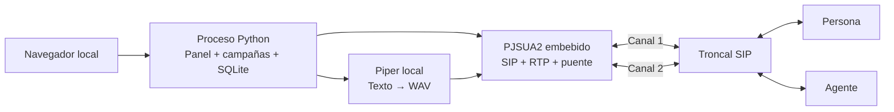

# Python Blaster TTS

Aplicación web **local**, escrita en Python, para campañas de llamadas salientes
con mensajes personalizados, menú por teclado y conexión con un agente mediante
una troncal SIP. El mismo proceso sirve el panel, controla las llamadas y mantiene
el puente de audio. No requiere Asterisk, FreeSWITCH, Redis, PostgreSQL ni una API
externa de TTS.

**Estado:** versión funcional con simulador, motor SIP real, Piper local y AMD
sin IA. Las pruebas automatizadas usan extremos locales. El operador confirmó
la recepción de llamadas reales, reproducción y timbrado del agente con su
troncal. La precisión del nuevo AMD requiere validación con buzones y personas
reales; no se han realizado llamadas externas para desarrollar esta función.

## Decisiones de arquitectura

Para dejarlo ejecutándose en **Ubuntu con el túnel cloudflared existente**, consulta
la [guía de producción](docs/production.md). Incluye el instalador, el servicio
`blaster`, arranque automático y el acceso por `tts.icc-soluciones.com`, manteniendo
HTTP en `127.0.0.1:8765`.

Elegí web local porque permite administrar campañas sin acoplar el motor a una
ventana de escritorio. El navegador sólo presenta controles y resultados; las
llamadas continúan aunque cierres la pestaña. **Cerrar el proceso Python sí corta
las llamadas.** Un único proceso debe permanecer encendido durante la campaña.

- **Python 3.11–3.13**, Linux o macOS. Linux es el destino recomendado para un
  equipo dedicado. Esta versión no soporta Windows de forma nativa.
- **FastAPI + Uvicorn:** panel local en `127.0.0.1:8765`, sin servidor web aparte.
  HTML, CSS y un JavaScript pequeño para la interfaz; toda la lógica de llamadas,
  campañas, persistencia y síntesis está en Python.
- **PJSIP 2.17 / PJSUA2:** biblioteca SIP/RTP embebida, manejada desde Python.
  Tiene componentes C/C++; no es un servidor ni un proceso independiente.
- **Piper:** síntesis neuronal local mediante su API Python. ONNX Runtime y el
  motor fonético también tienen componentes nativos. El modelo se descarga una
  vez; durante las llamadas no hay consultas a servicios TTS.
- **AMD sin IA:** reglas de energía, pausas y tonos, ejecutadas en Python/NumPy
  sobre el audio recibido. Se aplica antes del TTS y corta buzones probables.
- **SQLite:** archivo local, con estados y eventos persistentes.

“Todo Python” significa aquí aplicación y control en Python, con bibliotecas
nativas embebidas para telefonía y voz. No es una implementación de SIP, RTP y
síntesis escrita desde cero en Python puro.



## Arranque rápido: simulación

Desde esta carpeta, con Python 3.11, 3.12 o 3.13:

```bash
python3.13 -m venv .venv
.venv/bin/python -m pip install .
.venv/bin/python run.py
```

Abre [el panel local](http://127.0.0.1:8765). Pulsa **Probar con una demostración**,
después **Iniciar simulación** y selecciona un contacto. Cuando aparezca el
mensaje, usa **1** para repetir o **2** para enlazar con el agente. **Finalizar
llamada** y **El agente cuelga** prueban los dos extremos del cierre.

La simulación reproduce estados y duración de audio con WAV silenciosos; **no
emite llamadas ni genera voz real**. No necesita PJSUA2 ni el modelo Piper. Las
campañas están asociadas al modo donde se crearon: una campaña de simulación no
puede iniciarse en modo SIP real.

También puedes escuchar [un ejemplo generado localmente](examples/mensaje.wav).
Es una muestra con datos ficticios, generada por Piper, no una grabación telefónica.

### Voz seleccionada y latencia medida

La configuración usa `es_MX-claude-high` con dos trabajadores. En este MacBook
Air arm64 de 8 GB, el mismo mensaje produjo estos resultados sin abrir SIP:

| Motor y voz | Audio producido | Tiempo de generación |
|---|---:|---:|
| Piper `ald-medium` | 13.1 s | 1.49–2.24 s |
| Piper `claude-high` | 12.5–12.7 s | **0.62–0.73 s** |
| Kokoro ONNX INT8 `ef_dora` | 11.0 s | 10.89–12.63 s |

Son mediciones locales de tres repeticiones, no una garantía para otro equipo.
Kokoro usó cerca de 552 MB de memoria residente máxima frente a 316 MB para
`claude-high`. En una prueba de tres mensajes simultáneos, Piper con los dos
trabajadores configurados los terminó en 0.92, 1.25 y 3.19 segundos. Tres
trabajadores empeoraron el lote a unos 6 segundos por contención de CPU, por lo
que `tts_workers = 2` se conserva.

Puedes escuchar los tres WAV generados con el mismo texto en `examples/`:
`tts-piper-claude-high.wav`, `tts-piper-ald-medium.wav` y
`tts-kokoro-dora-int8.wav`. El audio de la llamada se convierte después a G.711
de 8 kHz; la comparación final también debe hacerse por teléfono.

## Instalación de telefonía y voz real

Se necesita un compilador C/C++, `make`, cabeceras de Python y SWIG. En Linux
Debian/Ubuntu, los paquetes habituales son `build-essential`, `python3-dev` y
`python3-venv`. En macOS se necesitan las Command Line Tools de Xcode.

Dentro del entorno virtual:

```bash
.venv/bin/python -m pip install '.[voice]' setuptools wheel swig
.venv/bin/python scripts/build_pjsua2.py
.venv/bin/python -m piper.download_voices es_MX-claude-high --download-dir voices
```

El script descarga el código oficial de PJSIP 2.17 en `build/`, configura 64
llamadas como máximo de compilación, compila el módulo Python e instala todo en
`.venv`. No instala una central ni modifica servicios del sistema. La primera
compilación puede tardar varios minutos. La aplicación limita el alcance a 60
canales / 30 sesiones y necesita dimensionamiento real antes de usar ese máximo.

Si Python de python.org en macOS no tiene certificados raíz configurados,
ejecuta su herramienta **Install Certificates.command**, o instala `certifi` y
usa su archivo de CA mediante `SSL_CERT_FILE`. No desactives la verificación TLS
para descargar dependencias. El adaptador SIP de esta versión usa UDP/TCP.

## Escuchar el mensaje antes de crear la campaña

En **Nueva campaña → Así será la llamada**, pulsa **Escuchar TTS**. La muestra
utiliza la voz configurada, los datos del primer contacto y el menú de opciones.
Puedes pausarla y volver a reproducirla. Si el mensaje no tiene variables, puedes
escucharlo incluso antes de cargar contactos o completar los demás campos.

Cambiar el mensaje, los contactos o la plantilla descarta el audio anterior para
que generes una muestra actualizada. La vista previa no crea llamadas ni consume
canales de la troncal. Consulta los [detalles de la vista previa](docs/tts-preview.md).

## Configurar la troncal

```bash
cp config.example.toml config.toml
```

Edita `config.toml`:

1. Cambia `mode` a `"sip"`.
2. Configura `sip.domain`, `username`, `registrar` y, si corresponde, `proxy`.
3. Usa `auth_username` si el usuario de autenticación es distinto; `caller_id`
   debe ser un identificador autorizado por el proveedor.
4. Si es autenticación por IP, usa `registration_enabled = false`. Si hace
   REGISTER, escribe la contraseña en `sip.password` dentro del TOML. No se guarda en SQLite
   ni se devuelve al navegador.
5. Ajusta la cantidad de canales contratados, concurrencia y llamadas por segundo.
6. Verifica la ruta al archivo `.onnx` y que exista su `.onnx.json` junto a él.
7. Configura `sip.dial_format` según el formato de números que requiere la troncal.

La configuración, incluida la contraseña, se lee directamente del TOML. Por ejemplo,
edita estos campos en la sección `[sip]` existente:

```toml
[sip]
domain = "sip.proveedor.example"
username = "usuario"
password = 'tu_contraseña'
registrar = "sip:sip.proveedor.example"
```

Las comillas simples de TOML conservan literalmente caracteres como `$` y `\`.
Si la contraseña contiene una comilla simple, usa comillas dobles y escapa `"` y
`\` como `\"` y `\\`. No se leen contraseñas de variables de entorno.

El puerto del panel se configura con `web_port = 8765` al principio del archivo,
antes de cualquier sección como `[amd]` o `[sip]`. Reinicia la aplicación después
de modificar el TOML.

Para comprobar la configuración y ejecutar:

```bash
.venv/bin/python run.py --config config.toml --check
.venv/bin/python run.py --config config.toml
```

`--check` comprueba configuración, archivos y módulos sin abrir la troncal. El
arranque en modo SIP puede registrar la cuenta, pero **no marca contactos** hasta
que inicias una campaña desde el panel. Para una troncal por IP, “conectada” sólo
indica que el endpoint está listo; no es una prueba de conectividad al proveedor.

## Prueba manual del registro SIP

Detén el panel con **Ctrl+C** en la terminal donde lo ejecutaste. Después:

```bash
.venv/bin/python scripts/check_sip.py --config config.toml
```

Este comando intenta un registro real, incluso si `mode = "simulation"`. Usa
los datos de `[sip]`, incluida la contraseña en el TOML, y requiere
`registration_enabled = true`. No abre el panel, no carga TTS ni genera llamadas.
Espera hasta 45 segundos y muestra resúmenes de los mensajes enviados y recibidos,
sin imprimir contraseñas ni cabeceras de autenticación. Al terminar cierra su
cuenta y solicita la baja de su registro; no modifica el TOML ni las campañas.

Un intercambio típico con autenticación Digest es:

```text
TX REGISTER — registro
RX 401 — solicitud de autenticación
TX REGISTER — registro
RX 200 — OK
REGISTRO CORRECTO. El servidor aceptó la cuenta.
```

El primer 401 puede ser un desafío normal de autenticación. Un 403 indica rechazo
del servidor; un 408 local indica que la operación agotó su espera. Si aparece
`RX 408`, llegó una respuesta 408 desde la red. Los códigos por sí solos no
identifican qué equipo o regla causa el problema.

Esta prueba verifica el registro; el audio RTP y las llamadas se comprueban
después. `ping` sólo comprueba ICMP; `nc -vz servidor 5060` comprueba TCP, y
`nc -zvu` no demuestra por sí solo que un servidor UDP haya respondido a SIP.
Vuelve a iniciar el panel con `.venv/bin/python run.py --config config.toml`.

`sip.local_port` es el puerto de esta máquina. El puerto de destino se indica
en `sip.registrar` (por ejemplo, `sip:servidor:5060`); cambiar el puerto local
no cambia el del proveedor. En la prueba realizada desde esta red, el registro
con puerto local 5060 agotó la espera, mientras que con 5070 completó la
autenticación y recibió 200 OK. Por ello, el `config.toml` local usa 5070.
Esta observación no identifica por sí sola qué equipo o regla bloqueaba el 5060.

Referencias: [registro y autenticación SIP](https://www.rfc-editor.org/rfc/rfc3261.html#section-10)
y [cuentas PJSUA2](https://docs.pjsip.org/en/2.17/api/generated/pjsip/group/group__PJSUA2__ACC.html).

### Registro correcto y llamada rechazada

Un registro aceptado no confirma que la cuenta tenga permisos o ruta para todos
los destinos. Si una llamada termina con 403, el panel conserva el código y la
frase de motivo que SIP proporcionó. La terminal también muestra el `Call-ID`
para que el proveedor pueda localizar el intento; no imprime las credenciales.
Si el motivo sólo dice `Forbidden`, todavía hace falta revisar las reglas del
proveedor. El motivo de llamadas anteriores no se puede recuperar si sólo se
guardó el código.

El formato se controla dentro de `[sip]`:

```toml
dial_format = "mexico_52"
```

`mexico_52` aplica la indicación del proveedor: **52 más los 10 dígitos nacionales,
sin signo +**. Se aplica tanto al contacto como al agente. Por ejemplo:

| Número capturado | Número enviado a la troncal |
|---|---|
| `525500000101` | `525500000101` |
| `5500000101` | `525500000101` |

No agrega `91`: ese prefijo pertenece al dialplan de Vici y se elimina allí antes
de enviar la llamada. Los destinos que no tienen un formato mexicano válido se
rechazan al crear o iniciar una campaña SIP. Los números nuevos se guardan sólo
con dígitos; la actividad de la llamada muestra el número que se marcó realmente.

El valor predeterminado `as_entered` no agrega prefijos. En ambos modos se eliminan
el signo `+`, espacios, guiones y paréntesis. El origen usa `sip.caller_id`, o
`sip.username` cuando el primero está vacío; debe estar autorizado por el proveedor.
El motor no vuelve a marcar automáticamente las llamadas fallidas.

### Tiempo de marcación del agente

La opción 2 interrumpe el mensaje y solicita la llamada al agente. El historial
registra por separado el envío del INVITE, las respuestas SIP 100/180/183 y la
respuesta 200 del agente. Los tiempos se miden desde que Python procesa la opción 2.
La terminal incluye además la recepción del DTMF y el tiempo en la cola de
marcación; no imprime cabeceras SIP ni credenciales.

Si el INVITE sale rápidamente y el aviso de timbrado llega varios segundos
después, esa demora ocurre después de enviar la solicitud. SIP 183 sólo indica
progreso de la llamada; no se presenta como confirmación de timbrado. El límite
`calls_per_second` sigue aplicándose a contactos y agentes.

## Detección de buzón sin IA

AMD está activado en el `config.toml` local y en el archivo de ejemplo. Analiza
el saludo antes de generar el TTS: un humano probable continúa, un buzón probable
provoca el cierre de la llamada. Usa señales y reglas configurables, sin modelos
de IA ni servicios externos. Todos los parámetros están en la sección `[amd]`.

El perfil inicial analiza como máximo 5000 ms y usa `unknown_action = "hangup"`:
también cuelga si el resultado es incierto. Esto prioriza reducir tiempo conectado,
pero puede descartar humanos que tarden en saludar. `"continue"` permite seguir
cuando no hay una conclusión. Para desactivarlo, usa `enabled = false`.

**No puede garantizar evitar el cargo inicial de un buzón**, porque necesita
audio después de que la llamada fue contestada. Tampoco garantiza precisión
perfecta: los saludos humanos y grabados pueden sonar iguales.

Consulta [comparación de alternativas, configuración y calibración](docs/amd.md).
Se incluye una prueba de WAV local que no abre la troncal:

```bash
.venv/bin/python scripts/check_amd.py --config config.toml --wav saludo.wav
```

## Red y compatibilidad inicial

- SIP IPv4 por UDP o TCP; audio G.711 μ-law y A-law (PCMU/PCMA).
- DTMF fuera de banda mediante RTP telephone-event. El callback de PJSUA2 también
  recibe SIP INFO cuando el proveedor lo envía. La prueba automatizada verifica
  telephone-event; SIP INFO debe comprobarse con la troncal. No se decodifican
  tonos DTMF dentro del audio.
- Puerto SIP configurable; por defecto 5060. Para RTP/RTCP se configura un rango
  UDP; por defecto 10000–10200. Se necesitan al menos dos puertos por canal.
- En NAT estático, anuncia `sip.public_address` y reenvía esos puertos hacia la
  máquina, conservando los números de puerto. Este alcance no usa STUN ni TURN.
  SIP ALG del router puede alterar la señalización y necesita revisión si hay
  problemas. Bajo CGNAT o NAT que cambie los puertos se necesita una ruta alcanzable
  acordada con el proveedor; no se puede prometer compatibilidad universal.
- El proveedor debe permitir dos llamadas simultáneas para conectar a una persona
  con un agente. Python permanece en el camino del audio.
- No se implementan TLS/SRTP, IPv6, WebRTC ni transferencia REFER. La respuesta SIP no
  distingue entre una persona y un buzón de voz.

## Flujo de una llamada

1. La cola reserva capacidad y aplica el límite de llamadas por segundo.
2. Se envía INVITE al contacto. No se reproduce el mensaje en early media / 183.
3. Al recibir confirmación y tener audio activo, si AMD está habilitado, se analiza
   primero el saludo en silencio. Los buzones probables se cuelgan. Si se permite
   continuar, se genera el mensaje personalizado y su menú con Piper; durante
   la generación se transmite un tono local de espera.
4. Se reproduce el WAV una sola vez. Se aceptan opciones durante el mensaje.
5. **1:** vuelve a reproducir ese mensaje; el número de repeticiones es configurable.
6. **2:** detiene el mensaje, mantiene a la persona con tono de espera y marca
   al agente por la misma troncal. El límite de llamadas por segundo también se
   aplica a esta segunda llamada.
7. Cuando el agente contesta y su audio está activo, se enlazan los flujos RTP
   en ambas direcciones. El TTS queda desconectado. Los dígitos recibidos después
   del enlace se reenvían al otro extremo mediante telephone-event.
8. Si cualquiera cuelga, se finaliza la otra llamada y se libera la capacidad.

**No es una transferencia que libere a Python.** Usar un puente local evita
depender de REFER/Replaces del proveedor, pero ocupa dos canales durante toda la
conversación. Con 10 canales, el límite conservador es 5 personas simultáneas,
cada una con su eventual agente. La reserva también aplica durante el timbrado.

No hay detección de disponibilidad humana del agente. Se marca el número
configurado y se espera respuesta SIP: puede ser un teléfono, un grupo que el
proveedor enrute, o un buzón. Varios clientes pueden marcar el mismo destino y
recibir ocupado si ese destino no acepta más llamadas.

## Campañas y datos

### Dashboard, CDRs y reportes

La pantalla inicial es un dashboard local con filtros por fecha, campaña y origen
SIP/simulación. Sus tasas se calculan sobre evidencia observada: una respuesta es
un SIP 2xx o una llamada confirmada y puede corresponder a una persona o a un buzón.
El resultado AMD se muestra por separado. Los registros anteriores a esta versión
se conservan como `legacy` y no se les inventan tiempos ni responsables.

En **Llamadas** se puede abrir el CDR completo de una sesión. El registro separa
los tramos cliente y agente y guarda, cuando existe evidencia:

- INVITE, timbrado, respuesta, audio activo y desconexión;
- Call-ID y respuesta SIP final de cada tramo;
- resultado y mediciones AMD, duración TTS y repeticiones;
- solicitud DTMF 2, marcación/respuesta del agente y duración del puente;
- quién inició el fin: cliente, agente, troncal, operador, sistema o desconocido.

`cliente` y `agente` identifican el tramo SIP remoto. La troncal puede ocultar o
originar un BYE, por lo que esto no acredita la identidad física de quien colgó.
Un desvío sólo es afirmable si se observa un SIP 3xx, REFER o la opción DTMF 2.

En **Reportes** se descargan CDRs CSV o un Excel con ocho hojas: resumen,
tendencia, resultados, campañas, CDRs, tramos, eventos y definiciones. Se genera
con una instantánea de lectura en un hilo separado, por lo que no pausa el motor
SIP. Sólo se genera un reporte a la vez y `report_max_rows` limita su tamaño; si
se excede el límite, el sistema pide reducir el período y nunca entrega
un archivo parcial.

SQLite conserva los metadatos de llamadas. No se guardan paquetes SIP ni contraseñas
SIP en la base. Las grabaciones se almacenan como archivos Ogg Opus y la base
guarda su referencia, estado y duración. Las duraciones usan reloj monotónico
y no son los segundos facturados por el proveedor.

La primera apertura actualiza la base de forma aditiva y, si ya había llamadas,
crea junto a ella una copia `blaster.sqlite3.before-analytics-XXXXXXXX.bak`. La
copia se crea una sola vez antes de incorporar las tablas analíticas.

Las opciones correspondientes en `config.toml` son:

```toml
reporting_timezone = "America/Mexico_City"
report_max_rows = 20000
```

La zona usa un nombre IANA y sólo afecta filtros y presentación; SQLite conserva
fechas ISO 8601 en UTC.

El CSV requiere `telefono`; las demás columnas son variables:

```csv
telefono,nombre,fecha,folio
525550000101,Ana,viernes 12 de septiembre,A 102
```

Ejemplo de mensaje:

```text
Hola {nombre}. Te recordamos tu cita del {fecha}. Tu folio es {folio}.
```

Estos números y datos son ficticios para simulación. Usa los números reales de
tu lista al crear una campaña SIP. Escribe los números con dígitos. Si pegas un
número con `+`, el formulario lo quita automáticamente, tanto para el agente como
en la columna `telefono` del CSV, incluso al importar un archivo. Los signos `+`
de nombres u otras variables se conservan. Al guardar también se eliminan espacios,
paréntesis y guiones. La aplicación aplica `sip.dial_format` al marcar; el formato
debe coincidir con el que requiere la troncal.

El menú se agrega automáticamente. La vista previa valida todos los contactos
y muestra el primero. Se admiten hasta 10 000 contactos por campaña y 4000
caracteres por mensaje resultante. Las variables sólo admiten nombres simples;
no ejecutan expresiones ni accesos a objetos.

- **Pausar:** deja de admitir nuevas sesiones; las ya admitidas continúan, incluso
  si están esperando su turno por el límite de llamadas por segundo.
- **Detener:** cancela pendientes y termina ambas llamadas de las sesiones activas.
- Se opera una campaña a la vez. Para cambiar de campaña, completa o detén la actual.
- Reducir la concurrencia no corta llamadas activas; se espera a que liberen lugar.
- El ajuste del panel dura durante ese proceso. Para conservarlo, edita
  `concurrency` en `config.toml`.
- Si se pierde el registro SIP, se suspenden las nuevas admisiones y se conservan
  los contactos pendientes hasta que la cuenta vuelva a estar disponible.
- Ocupado, sin respuesta, fallo de voz y agente no disponible se registran. No se
  reintentan automáticamente números fallidos. Si no hay selección, se repite el
  mensaje una vez y después se termina. `max_call_seconds` limita la sesión completa.
- Después de un cierre, las llamadas que estaban activas quedan interrumpidas y
  la campaña queda pausada. Los contactos pendientes requieren reanudación manual.
- Los WAV personalizados se eliminan al terminar; mensajes, números y eventos
  permanecen en `data/blaster.sqlite3`. Protege este directorio como datos de operación.

## Estructura

```text
run.py                       Entrada directa desde el proyecto
config.example.toml          Configuración documentada
src/blaster/
  config.py                  Validación de configuración y credenciales en TOML
  models.py                  CSV, contactos y plantillas
  store.py                   SQLite, resultados y eventos
  engine.py                  Concurrencia, CPS y flujo de cada llamada
  tts.py                     Piper y audio de simulación
  telephony/
    base.py                  Contrato de llamada y eventos
    simulated.py             Simulador sin red telefónica
    pjsua.py                  Endpoint SIP, reproductores y puente RTP
  web.py                     API y proceso único
  static/                    Panel de operación en español
scripts/build_pjsua2.py       Compilación local de la biblioteca nativa
tests/                       Pruebas del flujo, API y SIP local
examples/                    CSV y muestra de voz ficticios
docs/architecture.md         Responsabilidades y límites del motor
```

## Pruebas

```bash
.venv/bin/python -m pip install '.[dev]'
.venv/bin/python -m pytest -q
.venv/bin/ruff check src tests scripts run.py
```

La limpieza de números en el formulario tiene pruebas adicionales con Node.js
(usado sólo para estas pruebas):

```bash
node --test tests/phone-input.test.mjs
```

La prueba nativa requiere PJSUA2 compilado. Levanta un extremo de prueba temporal
en localhost; no utiliza la troncal ni marca números externos:

```bash
BLASTER_NATIVE_TEST=1 .venv/bin/python -m pytest tests/test_native_sip.py -q
```

Verifica respuesta, reproducción hasta EOF, recepción de DTMF, dos llamadas,
audio bidireccional mediante medición de frecuencias, reenvío de DTMF y BYE remoto.
También comprueba que el tono de espera siga activo durante varias repeticiones.
Si Piper y la voz de ejemplo están instalados, prueba el flujo completo con voz
real: generación tras contestar, espera superior a dos segundos, repetición del
mensaje, conexión con el agente y cierre. Todo ocurre entre extremos de localhost.
Antes de producción queda por validar un contacto real autorizado, audio en ambos
sentidos, DTMF, canal del agente, reconexión de registro y carga sostenida con tu
red y tu proveedor. No hay un rendimiento de llamadas por hardware certificado.

El panel escucha sólo en loopback, dispone de cuentas y roles, restringe
Host/Origin y evita ejecuciones duplicadas mediante un bloqueo del directorio de
datos. El despliegue con cloudflared configura `web_public_url` en el TOML y crea
el administrador inicial antes de publicar el panel. No lo arranques con varios
workers ni con auto-reload cuando uses la troncal.

## Referencias técnicas y dependencias

- [PJSUA2: conceptos y manejo de hilos](https://docs.pjsip.org/en/latest/pjsua2/general_concept.html).
- [PJSUA2: audio y conexión de medios](https://docs.pjsip.org/en/latest/pjsua2/using/media_audio.html).
- [Compilación de PJSUA2 para Python](https://docs.pjsip.org/en/latest/pjsua2/building.html).
- [Piper: API Python](https://github.com/OHF-Voice/piper1-gpl/blob/main/docs/API_PYTHON.md).

## Licencia

El código original de la aplicación se distribuye bajo la licencia [MIT](LICENSE).
Las dependencias y voces conservan sus propias licencias, incluidas las condiciones
GPL o comerciales de PJSIP y Piper según el componente. Sus avisos y procedencia
se documentan en [THIRD_PARTY.md](THIRD_PARTY.md).


## Operación, usuarios y automatización

Al abrir el panel por primera vez, crea el administrador con una contraseña de
al menos 12 caracteres. Después se requiere iniciar sesión. Los usuarios se
administran en **Operación → Usuarios**:

| Rol | Acceso |
| --- | --- |
| Administrador | Toda la operación, configuración SIP, usuarios y auditoría. |
| Operador | Campañas, plantillas, programación, reportes, alertas y grabaciones. |
| Analista | Consultas y descargas de reportes; no modifica datos ni escucha audio. |

Las contraseñas de usuarios se guardan como huellas scrypt con sal aleatoria;
las sesiones son opacas, tienen caducidad y se revocan al modificar el acceso.
Debe quedar al menos un administrador activo. Los cambios y accesos a audio quedan
en la auditoría. El panel sigue limitado a localhost: no se habilita acceso remoto.

### Troncales, distribución y capacidad

**Operación → Troncales** administra hasta ocho cuentas SIP dentro de un único
endpoint PJSUA2. La configuración antigua `[sip]` sigue funcionando como una sola
troncal llamada `default`. Al guardarla desde el panel, se utiliza `[[trunks]]`.
No necesitas configurar un respaldo para operar.

- Menor `priority`: ruta preferida. Las prioridades mayores sirven como respaldo.
- A igual prioridad, `routing = "priority"` distribuye de forma equilibrada;
  `routing = "weighted"` utiliza los pesos relativos configurados.
- Cada sesión reserva dos canales **en la misma troncal**, para cliente y agente.
- Se respetan los límites globales y por troncal de canales y llamadas por segundo.
- Una troncal sin registro disponible no recibe llamadas. Ante respuestas finales
  408/502/503/504 antes de una respuesta del cliente, se cierra ese intento y puede
  utilizarse otra ruta. Un 403 o un ocupado no producen cambio automático.
- Una ruta con esos fallos descansa al menos 30 segundos, respetando Retry-After
  hasta un máximo de 24 horas. No se migra una conversación establecida.
- Un timeout de timbrado con INVITE todavía activo no inicia otra llamada en paralelo.
- Los intentos previos siguen en el CDR y en la hoja Tramos; la fila resumen refleja
  el último intento del cliente. El historial de troncal conserva cambios y estados.

Los puertos SIP/RTP, transporte UDP/TCP, autenticación, formato de marcación,
prioridad, peso y canales se editan en el formulario de cada troncal. El puerto
remoto se expresa como `servidor:puerto`; `local_port` corresponde a este equipo.
Los canales globales, concurrencia, llamadas por segundo y tiempos se editan en
**Operación → Configuración**, que también incluye un selector de troncal para
editar directamente sus puertos SIP/RTP. Esta compilación permite hasta 60 canales globales
(30 sesiones reservadas), sin prometer que el equipo pueda sostener ese máximo.
La configuración se valida y se aplica sin campañas activas; un fallo al iniciar
el motor restaura la configuración anterior. Los cambios se guardan en TOML.

Las contraseñas SIP permanecen exclusivamente en el TOML, con permisos 0600.
El panel nunca devuelve la contraseña actual: dejarla vacía al editar la conserva.
SQLite conserva los perfiles no secretos y el historial. Para probar una cuenta
manualmente con la aplicación detenida:

```bash
.venv/bin/python scripts/check_sip.py --config config.toml --trunk default
```

Este comando sólo prueba REGISTER; una cuenta autenticada por IP no necesita registro.

### Plantillas y programación de llamadas

Guarda mensajes con `{nombre}`, `{fecha}` u otras columnas del CSV en
**Operación → Plantillas**. Pueden incluir un agente predeterminado. Usar una
plantilla copia el mensaje a la campaña; editarla después no cambia campañas existentes.

Desde una campaña pulsa **Programar**, o utiliza **Operación → Programación**.
Elige fecha, hora y zona IANA. La agenda se guarda en SQLite y no depende del navegador.
El motor debe estar abierto: una sola campaña se ejecuta a la vez. Cuando está
ocupado o no hay rutas disponibles, las siguientes esperan hasta el margen
`late_schedule_minutes` (60 minutos por defecto); después quedan vencidas y
producen una alerta. No se relanzan contactos ya procesados ni se duplican campañas.
Iniciar manualmente cancela su programación pendiente. Detener cancela también
los contactos pendientes; para conservarlos, usa Pausar.

### Reportes automáticos y alertas

**Operación → Reportes automáticos** permite generar Excel o CSV cada día o semana,
a una hora/zona elegida y sobre los últimos N días completos anteriores al horario
programado. Cada ejecución tiene un identificador único; al reiniciar se registra
una ejecución interrumpida sin duplicarla. Los archivos y errores aparecen en el
panel. No se mandan correos ni mensajes a servicios externos.

Las alertas cubren troncales no disponibles, porcentaje de llamadas fallidas en
15 minutos, horarios vencidos, errores de captura/espacio y reportes disponibles.
Reconocer una alerta no borra su historial. La recuperación de la condición resuelve
las alertas técnicas automáticamente. Los umbrales se editan en Configuración.

### Grabación compacta de llamadas con evidencia humana

`[recordings].enabled = true` activa la captura **después** de un resultado AMD
`human` (probable), o de una selección DTMF 1/2 si todavía no había grabación. Un
buzón detectado o un saludo incierto sin interacción no se graba. El AMD puede
equivocarse; esto no constituye identificación infalible de una persona.

Se mezcla el audio entrante del cliente, el TTS reproducido desde que comienza la
captura y la voz del agente durante el puente. La captura nativa temporal es WAV
mono de 8 kHz; al finalizar se espera el cierre real del archivo y se comprime
localmente a **Ogg Opus**. La codificación usa un máximo de dos trabajadores y elimina
el WAV. El tamaño depende de la duración y contenido; no es una grabación PCM permanente.

El CDR muestra estado, evidencia, tamaño, reproductor y descarga. Un analista no
puede acceder al endpoint de audio. Las grabaciones de simulación se etiquetan como
sintéticas. Por defecto se conservan 30 días, con límite configurado de 10240 MB y
reserva de espacio libre de 256 MB. Al vencer, se elimina el audio y se conserva
el CDR. Si falta espacio, se omite la captura y se genera una alerta; la llamada continúa.

Opciones adicionales, presentes en `config.example.toml`:

```toml
[auth]
enabled = true
session_hours = 8

[recordings]
enabled = true
retention_days = 30
max_storage_mb = 10240
min_free_mb = 256

[automation]
enabled = true
poll_seconds = 5.0
late_schedule_minutes = 60
trunk_alert_seconds = 60
failure_alert_percent = 50
failure_alert_min_calls = 10
report_retention_days = 90
```

La migración operativa crea tablas nuevas y `call_legs.trunk_id`. Si existe historial,
primero guarda una copia `.before-operations-XXXXXXXX.bak`. Las copias de SQLite
no incluyen los archivos de grabación ni los reportes generados. Conserva también
`data/recordings`, `data/reports` y el TOML cuando respaldes toda la instalación.
