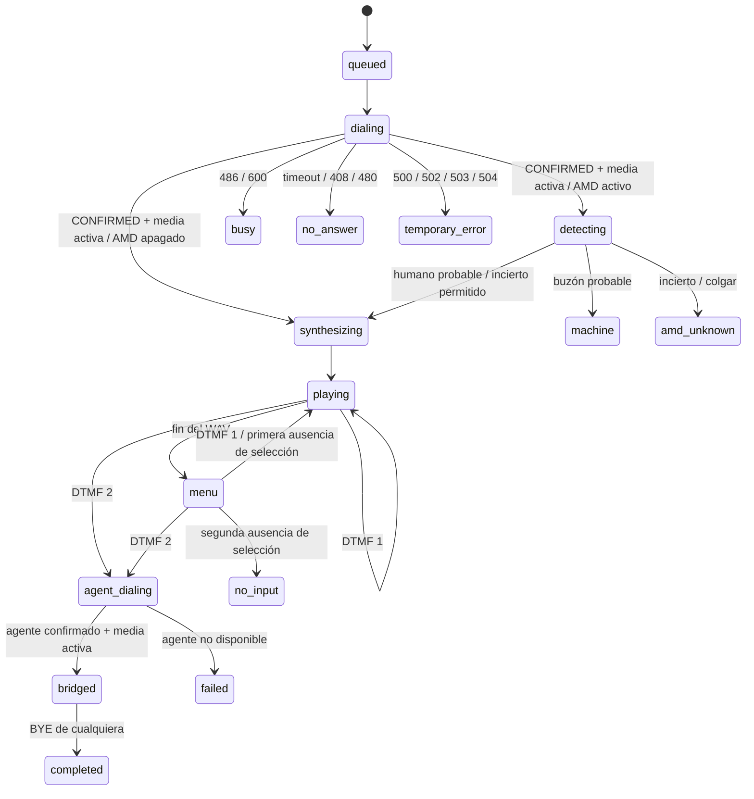

# Arquitectura del motor y del panel

## Responsabilidades

`Engine` controla sesiones con asyncio. Cada sesión tiene un contacto, un mensaje
ya interpolado y hasta dos llamadas. Las escrituras operativas a SQLite se realizan desde ese mismo hilo; los reportes usan conexiones de lectura independientes.
El scheduler admite sesiones hasta el menor límite configurado; la validación
exige `2 * concurrency <= trunk_channels`. La reserva de canal para el agente
es conservadora y evita llenar la troncal con personas a las que luego no puede
atenderse. Un bloqueo separado limita el ritmo de INVITE de ambas clases de llamada.

`PJSUATelephony` crea exactamente un Endpoint en un hilo Python dedicado. Allí
se inicializa PJSIP, se procesan los comandos de la cola y se llama a
`libHandleEvents`. `threadCnt=0` y `mainThreadOnly=True` mantienen la señalización
y sus callbacks en el hilo propietario. Los callbacks de fin de audio pueden
llegar desde un hilo nativo: sólo notifican al bucle asyncio de forma segura.

Los objetos Call, Account y AudioMediaPlayer se conservan mientras la biblioteca
puede referenciarlos. La destrucción nativa se ejecuta en el hilo propietario,
fuera del callback de desconexión/EOF. Los diálogos permanecen en el registro
nativo hasta DISCONNECTED, aunque una tarea de campaña haya sido cancelada.
El puente permanece en PJMEDIA. Durante AMD, un AudioMediaPort recibe sólo el
audio entrante del contacto y copia PCM a una cola acotada; no mezcla otras
llamadas ni el TTS. Fuera de AMD, Python no copia muestras de la conversación.

El puente conecta el AudioMedia del contacto con el del agente y viceversa. No se
usa el puerto de micrófono/altavoz, y se activa un dispositivo nulo para el reloj
de medios. Una actualización de media intenta reconectar la pareja. REFER entrante
se rechaza: sólo el scheduler puede originar llamadas.

`PiperSpeech` carga un conjunto acotado de voces al iniciar y entrega cada voz a
una sola inferencia a la vez. La síntesis ocurre en hilos de Python ajenos al hilo
SIP. El WAV PCM de 16 bits puede tener la frecuencia original de la voz; PJMEDIA
lo convierte al reloj del códec negociado. El motor sintetiza el mensaje
completo después de la respuesta, por lo que hay una espera proporcional a su
longitud y a la carga. `tts_timeout` limita la espera lógica, pero una inferencia
nativa en ejecución no se puede interrumpir: se espera su finalización antes de
eliminar archivos. Una inferencia nativa que se bloquee requeriría reiniciar el
proceso; el aislamiento de inferencia en procesos sería una ampliación futura.

## Estados

Cancelación, cierre del proceso, errores y duración máxima pueden finalizar una
sesión desde otros estados. Cada transición persiste un evento. La cancelación
recoge las tareas auxiliares, detiene reproductores y cuelga ambos extremos.
Los resultados configurados pueden crear un nuevo trabajo de reintento, con CDR e
ID propios y el mismo Credito/Telefono. Una recuperación no reorigina llamadas
cuyo resultado o cierre se desconoce.

## Telemetría analítica y CDR

`call_records` contiene una fila por sesión iniciada, `call_legs` separa el tramo
cliente y el tramo agente, y `call_events` conserva la cronología estructurada.
Las tablas originales `jobs` y `events` siguen siendo el estado operativo y su
historial legible. El esquema actual es `PRAGMA user_version=7`: la migración de
trazabilidad añade `credit_id` e índices por crédito y teléfono. Las filas previas
conservan Crédito vacío y cualquier medida no observada permanece NULL.

Los callbacks de PJSUA2 producen eventos pequeños y los entregan al bucle asyncio;
no escriben SQLite ni procesan informes en el hilo de medios. La respuesta y la
terminación se derivan de estados/transacciones SIP. Los reportes abren una conexión
SQLite de sólo lectura, fijan una instantánea y se generan con `asyncio.to_thread`.
El audio de AMD continúa siendo efímero y no entra a la base ni a los reportes.

El pool reserva un destino antes de marcar al agente y despierta al planificador
en cada cambio. Si la campaña activa tiene cero destinos libres, el planificador
no reclama nuevos trabajos de contacto. La liberación sólo ocurre después de la
confirmación de cierre SIP; entonces se levanta la pausa de capacidad y vuelve a
evaluarse concurrencia, canales, CPS y rutas antes de originar la siguiente llamada.

El actor remoto se etiqueta con el rol del tramo. Un BYE del tramo cliente produce
`customer`; un BYE del tramo agente produce `agent`. Cuando PJSIP sólo informa una
desconexión sin método observable, el actor queda `unknown`. Las órdenes de parada,
timeouts y políticas AMD se atribuyen al operador o al sistema con su evidencia.

## Límites y siguientes ampliaciones

Esta versión cubre hasta ocho cuentas/troncales, una campaña activa y un pool de
teléfonos de agente por campaña. No distribuye llamadas entre varias máquinas. Incluye roles,
programación local persistente y grabación compacta desde evidencia humana. El AMD local
analiza al contacto antes del TTS; no analiza la llamada al agente. Véase
[el alcance y las limitaciones de AMD](amd.md).

No se utiliza REFER porque liberar las dos llamadas locales después de una
transferencia depende del soporte y la política de la troncal. La consecuencia
es explícita: dos canales y flujo RTP a través de la máquina hasta el cierre.

El inicio de Piper precede al de SIP; la creación de la campaña valida todos los
datos antes de marcar. El panel web es un cliente ligero del mismo proceso y no
tiene ninguna responsabilidad en la continuidad de las llamadas. SQLite guarda
texto, huellas de contraseñas de usuarios y datos operativos. Las contraseñas SIP
permanecen en TOML. El audio TTS es efímero; las grabaciones Opus se conservan
según la política configurable y se sirven mediante un endpoint autenticado.

## Operación y acceso

`operations.py` migra perfiles no secretos, historial de troncales, usuarios,
sesiones, auditoría, plantillas, agenda, reportes, alertas y referencias de audio.
`security.py` valida sesiones con tokens opacos (sólo su hash en BD), scrypt y
caducidad. El middleware verifica cada API; no se confía en controles ocultos del
navegador. Las mutaciones quedan auditadas sin cuerpo ni secretos.

`traceability.py` migra el identificador de crédito y construye paquetes ZIP en un
archivo temporal con permisos privados. El XLSX y el manifiesto incluyen todas las
llamadas del corte; sólo se agregan audios cuyo nombre, ruta y estado coinciden con
el trabajo. Ogg se copia sin recomprimir y el temporal se elimina al terminar la
respuesta. La API limita el corte con `report_max_rows` y registra cada descarga.

`TrunkRouter` reserva dos canales por sesión en una ruta y selecciona por prioridad
con reparto equilibrado o ponderado entre iguales. PJSUA2 mantiene múltiples
Account sobre un Endpoint, reutilizando transportes con los mismos parámetros.
El CPS global y por ruta incluye el tramo del agente. Los intentos anteriores del
cliente conservan su fila con rol `customer_attempt_<id>`; el rol `customer`
identifica el último intento y evita duplicar los totales de la analítica.

`Automation` consulta la agenda persistente en el bucle asyncio. Cada reporte se
reclama con `(schedule_id,due_at)` único, se genera en un hilo con conexión de sólo
lectura y comparte la exclusión de exportación con los reportes manuales. No hay
procesos cron externos ni llamadas programadas que dependan del navegador.

`Recordings` inicia un recorder nativo después de la evidencia humana. La mezcla
recibe cliente, reproductor TTS y agente. La retirada asíncrona de un puerto
PJMEDIA puede posponer el cierre WAV: antes de comprimir se verifican longitudes
RIFF/data finalizadas, con espera limitada en un hilo. SoundFile/libsndfile
codifica Opus en bloques, dos conversiones simultáneas como máximo, y vuelve a
abrir el archivo antes de marcarlo listo. Los WAV temporales se eliminan y el
CDR retiene metadatos aun cuando vence el audio.
